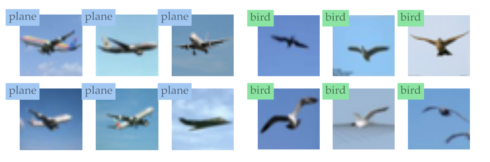

<h1>Datamodels</h1>
<p align='center'>
Compute <a href='https://arxiv.org/abs/2202.00622'>datamodels</a> easily with <code>datamodels</code>!
</p>
<p align='center'>
        [<a href='#overview'>Overview</a>]
        [<a href='#examples'>Examples</a>]
        [<a href='#tutorial'>Tutorial</a>]
        [<a href='#citation'>Citation</a>]
        <br/>
        
        <it>Figure: Datamodels are a versatile tool for understanding datasets through the lens of the model class. Above figure illustrates one application of finding conflicting subpopulations; we show examples from a top principal component of datamodel embeddings on CIFAR-10. </it>
        <br/>
</p>

This repository contains the code to compute *datamodels*, as introduced in our paper:

**Datamodels: Predicting Predictions with Training Data** <br>
*Andrew Ilyas\*, Sung Min Park\*, Logan Engstrom\*, Guillaume Leclerc, Aleksander Madry* <br>
Paper: https://arxiv.org/abs/2112.01008 <br>

## Overview
Use the `datamodels` library to compute datamodels for *any* choice of model and dataset:
    <ol type="a">
    <li>Train a large number of models (any model!) on different subsets of the training set of choice [1];</li>
    <li>Store their outputs (any output! e.g., margins, confidences, or even model weights); and</li>
    <li>Compute datamodels from the above data using our [fast_l1](https://github.com/MadryLab/fast_l1) library for large-scale sparse linear regressions.</li>
    </ol>

[1] While we focus on varying the training set composition, you can vary any desired parameters within each training run and can also use our code for grid search, for example.

## Examples
The easiest way to learn how to use `datamodels` is by example, but we also provide a general [tutorial](#tutorial) below.


<b>Simple examples</b> for a <b>toy setting</b> and <b>CIFAR-10</b> that run out of the box!
<ul>
    <li> <b>Toy Setting</b>: See <a href="examples/minimal/">examples/minimal</a> for a dummy example that illustrates how the entire pipeline works together. Simply run <code>example.sh</code>.</li>
    <li> <b>CIFAR10</b>: See <a href="examples/cifar10">examples/cifar</a>:
    <ul>
    <li> To train, run <code>example.sh</code>, which will create necessary data storage, train models, and log their outputs. You must run this script from the root of the <code>datamodels</code> directory for it to work properly. The script also assumes you are running with a machine with access to 8 GPUs (you can modify as appropriate). </li>
    <li> To compute datamodels, run <code>example_reg.sh</code> after modifying the variable <code>tmp_dir</code> to be the directory output by the training script. </li>
    </ul>
    </li>
</ul>

### Pre-computed data on CIFAR-10
For pre-computed datamodels on CIFAR-10 (from traing hundreds of thousands of models!), check out <a href='github.com/MadryLab/datamodels-data'>here</a>.


## Tutorial
Computing datamodels with the `datamodels` library has two main stages:
    <ol type="I">
    <li>**Model training**: Training models and storing arbitrary data in the form of tensors (these
   could include predictions, logits, training data masks, or even model
   weights);</li>
    <li>**Regression**: Fitting a sparse linear model from any binary covariates (e.g., training
   masks, as in [our paper]()) to a continuous outcome (e.g., margins, as in our
   paper).</li>
    </ol>
    The first stage takes up the bulk of compute, but is readily parallelizable by nature.

We describe each stage in detail below.

### I. Training models and storing data

There are four key steps here:
1. Write a specification file (in JSON) that pre-declares
   the data you want to save for each model and the total number of models.
2. Create a "store directory" with empty memory-mapped `numpy` arrays based on the above a spec.
3. Make a Python file that implements a `main` function:
   given an index `i`, the main function should execute the appropriate training task (potentially using parameters specific to that index), and return a dictionary whose keys map to the datatypes declared in the specification file.
4. Run a worker for each model that you want to train,
   passing the above Python file and a different index `i` to each one.
   Each worker will call the specified file with the given index.

#### Detailed overview
(Follow along in `examples/minimal/` and in particular `examples/cifar10/example.sh`)

1. **Making a spec file**: The first step is to make a JSON specification file,
which pre-declares what data to record during model training.
   The spec file has two fields, "num_models" (the number of models that will be trained) and
   "schema", which maps keys to dictionaries containing shape and dtype information:
    ```
    {
        "num_models": 100,
        "schema": {
            "masks": {
                "shape": [50000],
                "dtype": "bool_"
            },
            "margins": {
                "shape": [10000],
                "dtype": "float16"
            }
        }
    }
    ```
    The `dtype` field is any attribute of `numpy` (i.e., `float` or `uint8` or `bool_`, the numpy boolean type). `num_models` specifies how many models will be trained.

2. **Setting up the data store**: Use the spec to  make a store
   directory containing contiguous arrays that will store all model outputs:
    ```
    python -m datamodels.training.initialize_store \
        --logging.logdir=$LOG_DIR \
        --logging.spec=examples/cifar10/spec.json
    ```
    The output directory after initialization:
    ```
    > ls $LOG_DIR
    _completed.npy
    masks.npy
    margins.npy
    ```
    (`_completed.npy` is used internally to keep track of which models are trained.)

    Each array is of size ($N$ x ...), where $N$ is the number of models to train, and ... is the shape of
   the data that you want to write (could be scalar, could be vector, could be any shape but there will be $N$ of them concatenated together).
    That is, it will contain a numpy array  with shape: `(num_models, schema[key])` for each key in the schema field.

3. **Writing a training script**: Next, make a training script with a `main`
   function that just takes an index `index` and a logging directory `logdir`.
   The training script should return a Python dictionary mapping the keys
   declared in the `schema` dictionary above to numpy arrays of the correct
   shape and dtype.

   Note that you probably don't have to use `logdir` unless you want to write
   something other than numpy arrays. Here is a basic example of a `main.py`
   file:
   ```
   def main(*_, index, logdir):
       # Assume 50,000 training examples and datamodel alpha = 0.5
       mask = np.random.choice(a=[False, True], size=(50_000,), p=[0.5, 0.5])
       # Assume a function train_model_on_mask that takes in a binary
       # mask and trains on the corresponding subset of the training set
       model = train_model_on_mask(mask)
       margins = evaluate_model(model)
       return {
           'masks': mask,
           'margins': margins
       }
   ```
    The worker will automatically log each key, value in this
    dictionary as a row `<value>` in `logdir/<key>.npy`.
    Note that (as you'll see in the example scripts), you need to manually
    create and save training masks (`datamodels` can log it for you but you will
    need to generate your own masks and then apply them to the training data).

4.  **Running the workers.** The last step is to pass the training script to the
    workers. Each worker run will write into a single index of each contiguous
    array with the datamodel results. Train `num_models` models, each outputting
    matrices corresponding to the (`n`, shape)-shape matrices found in the spec
    file.

    ```
    python -m datamodels.training.worker \
        --worker.index=0 \
        --worker.main_import=examples.cifar10.train_cifar \
        --worker.logdir=$LOG_DIR
    ```
    Note all the arguments not specified in the `datamodels/worker.py` file
    (e.g., `--trainer.multiple` above) will be passed directly to the training
    script that your `main` method is located in.

    You can decide how to best run thousands of workers for your compute environment. An
    example in GNU parallel with 8 workers at once would be:
    ```zsh
    parallel -j 8 CUDA_VISIBLE_DEVICES='{=1 $_=$arg[1] % 8 =}' \
                        python -m datamodels.training.worker \
                        --worker.index={} \
                        --worker.main_import=examples.minimal.train_minimal \
                        --worker.logdir=$LOG_DIR ::: {0..999}
    ```
    For our projects, we use GNU parallel in conjunction with our SLURM cluster.

### II. Running sparse linear regression

After training the desired number of models, you can use
`datamodels.regression.compute_datamodels` to fit sparse linear models from
training masks (or any other binary output saved in the last step) to model outputs
(any other continuous output saved in the last stage). There are only three steps here:

1. **Writing a dataset**: First, we convert the data (stored in memory-mapped
   arrays from the previous stage) to [FFCV](https://ffcv.io) format (`.beton`):

   ```
   python -m datamodels.regression.write_dataset \
                --cfg.data_dir $LOG_DIR \
                --cfg.out_path OUT_DIR/reg_data.beton \
                --cfg.y_name NAME_OF_YVAR \
                --cfg.x_name NAME_OF_XVAR
   ```

2. **Making a config file**: The next step is to make a config file (`.yaml`) specifying the data as well as hyperparameters for the regression. For example:
    ```yaml
    data:
        data_path: 'OUT_DIR/reg_data.beton' # Path to FFCV dataset
        num_train: 90_000 # Number of models to use for training
        num_val: 10_000 # Number of models to use for validation
        seed: 0 # Random seed for picking the validation set
        target_start_ind: 0 # Select a slice of the data to run on
        target_end_ind: -1 # Select a slice of the data to run on (-1 = end)
        # If target_start_ind and target_end_ind are specified, will slice the
        # output variable accordingly
    cfg:
        k: 100 # Number of lambdas along the regularization path
        batch_size: 2000 # Batch size for regression, must divide both num_train and num_val
        lr: 5e-3 # Learning rate
        eps: 1e-6 # Multiplicative factor between the highest and lowest lambda
        out_dir: 'OUT_DIR/reg_results' # Where to save the results
        num_workers: 8 # Number of workers for dataloader
    early_stopping:
        check_every: 3 # How often to check for inner and outer-loop convergence
        eps: 5e-11 # Tolerance for inner-loop convergence (see GLMNet docs)
    ```

3. **Running the regression**: The last step is to just run the regression script:
   ```
   python -m datamodels.regression.compute_datamodels -C config_file.yml
   ```


## Citation
If you use this code in your work, please cite using the following BibTeX entry:
```
@inproceedings{ilyas2022datamodels,
  title = {Datamodels: Predicting Predictions from Training Data},
  author = {Andrew Ilyas and Sung Min Park and Logan Engstrom and Guillaume Leclerc and Aleksander Madry},
  booktitle = {ICML},
  year = {2022}
}
```
